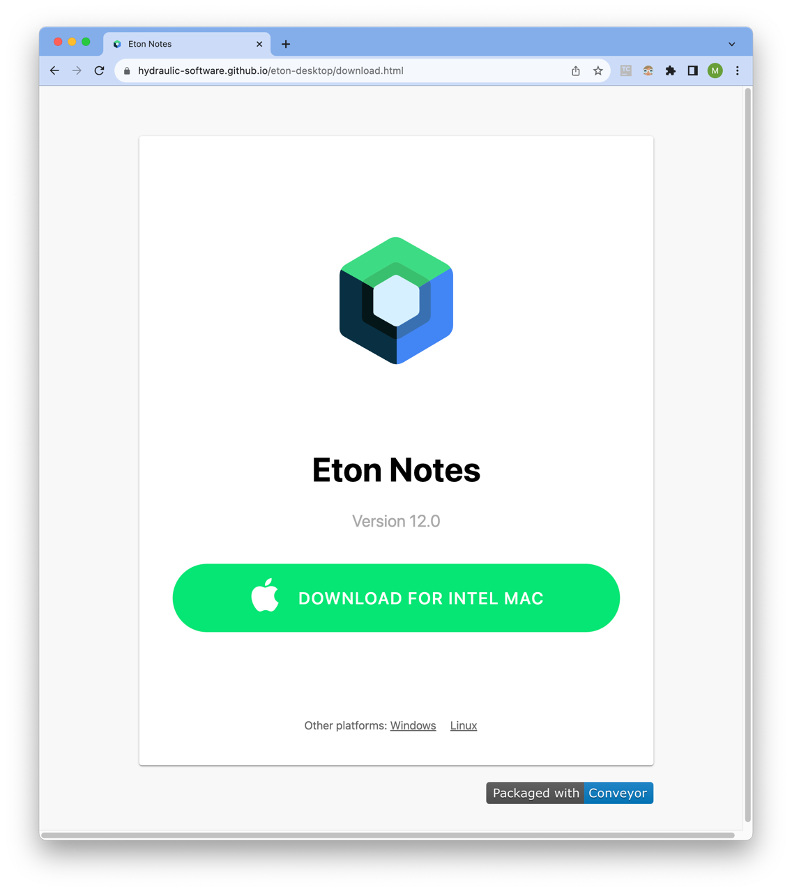

# Download/update site

The `site` task will generate the online update repository along with a static download page. The `copied-site` task will additionally
copy the results to another directory, which can be on a remote system accessible via SFTP. 

The download page is optional and can just be ignored if you don't want it. It has these features:

* Detects the user's operating system. Allows the user to switch between operating systems.
* On Chrome, detects the CPU architecture.
* Access to both primary package formats for each platform, and alternatives like raw zips or tarballs.
* Provides copy/pasteable terminal commands to install the app on Linux.
* Shows your app logo.

[See an example](https://downloads.hydraulic.dev/eton-sample/download.html)



## Synopsis

```
app.site {
  display-name = Title of the web page.

	# Where the installed packages can check for online updates.
  base-url = somesite.com/downloads

  # Import an HTML template or additional files to the generated site.
  inputs += "my-template-dir/*" -> .
  
  # Change the set of images used for the logo, as found in the resolved inputs.
  icons = "my-icons-*.png"
  
  # Which keys appear in the metadata.properties file in the generated site.
  export-keys = [ app.version, app.revision ]
  
  # HTML to add into the <head> area.
  extra-header-html = """
  	<script>
  		// etc
  	</script>
  """
  
  # Directory to upload/copy the site to over SFTP.
  copy-to = "//user@myserver.com/var/www/downloads"
}
```

## Icon

The `app.site.icons` key works the same way as the other icon keys do (in the `windows`, `mac` and `linux` sections respectively). The default `app.site.inputs` list contains the value of `${app.site.icons}` so you can use alternative file names by just setting the image name here. However, if you have a file named `icon.svg` as an input, it'll be used as the icon instead of the rendered files.

Here's an example of how to import icons from a different directory than the one containing the config and use it at the top of the generated HTML.

```
app.site {
  base-url = downloads.hydraulic.dev/${channel}/compose-sample
  icons = "../../packaging/images/icon-{32,64,128,256}.png"
}
```

## Exporting to metadata.properties

When you generate a download/update site with `conveyor make site` one of the generated files is called `metadata.properties`. It's a text file containing key=value pairs and by default will look like this:

```properties
#Sun Dec 04 18:41:57 CET 2022
app.long-fsname=vendor-name-product-name
app.revision=0
app.windows.manifests.version-quad=2.1.0.0
app.version=2.1
```

The keys to export are controlled by the `app.site.export-keys` key and the default value is:

```
export-keys = [app.long-fsname, app.version, app.revision, app.windows.manifests.version-quad]
```

You can export any key that maps to a string, number or boolean. Objects and lists can't be exported. Here's an example of exporting a multi-line string:

```

release-notes = """
    New feature: We've integrated AI and blockchain to make your work really fizz!
    Also - bug fixes.
"""
app.site.export-keys += release-notes
```

The resulting `metadata.properties` file will have a key that looks like this:

```properties
release-note=New feature: We've integrated AI and blockchain to make your work really fizz!\nAlso - bug fixes.\n
```

Notice that the newline characters are escaped and the indent/leading whitespace were stripped. 

## Publishing through GitHub

Conveyor's repository sites are designed to be compatible with GitHub releases. Using them is easy:

1. Set your `app.vcs-url` to point to `https://github.com/user/repo`. This will automatically set `app.site.base-url` to be `github.com/$user/$repo/releases/latest/download`. If you aren't packaging an open source app then don't set `vcs-url` and set the `site.base-url` key to that location manually. 
2. Run `conveyor make site` as usual to get an output directory.
3. Create a new release and upload the contents of the output directory, minus `download.html` and any extra files you used, like icon files. [Take a look at this example release to see what you should have.](https://github.com/hydraulic-software/eton-desktop/)
4. Take the generated `download.html` file and stick it on your website somewhere.

That's it! To upgrade your users just create a new GitHub release as normal. The auto-update engines will be checking the metadata files on whatever your latest release is to discover what to download.

Be aware of these caveats:

* Your users will upgrade to whatever the `/releases/latest` URL points to. Therefore, you shouldn't do beta releases or other forms of pre-release this way. Stick those files somewhere else or use draft releases, etc.
* The `download.html` file contains links to the "latest" files but their file names will contain the version number. Therefore you should copy the HTML to your website each time you do a release, otherwise users will get 404 errors.

Future versions of Conveyor might automate the process of doing the uploads to GitHub.

## Publishing via SFTP

If you set `app.site.copy-to` to a string like `//hostname/directory` then you can use the `copied-site` task to both build the downloads
and upload the resulting download site to a remote server. The directory should be absolute, and you can specify both username and password
in the machine part (it's basically an `ssh://` url but minus the scheme). Public/private keys and the `known_hosts` file will be read from
the usual locations as used by OpenSSH, but Conveyor won't log in to a server it doesn't recognize, so if you would get a new key warning
from regular `ssh` you will need to log in first, to ensure the key goes into the `known_hosts` file.
