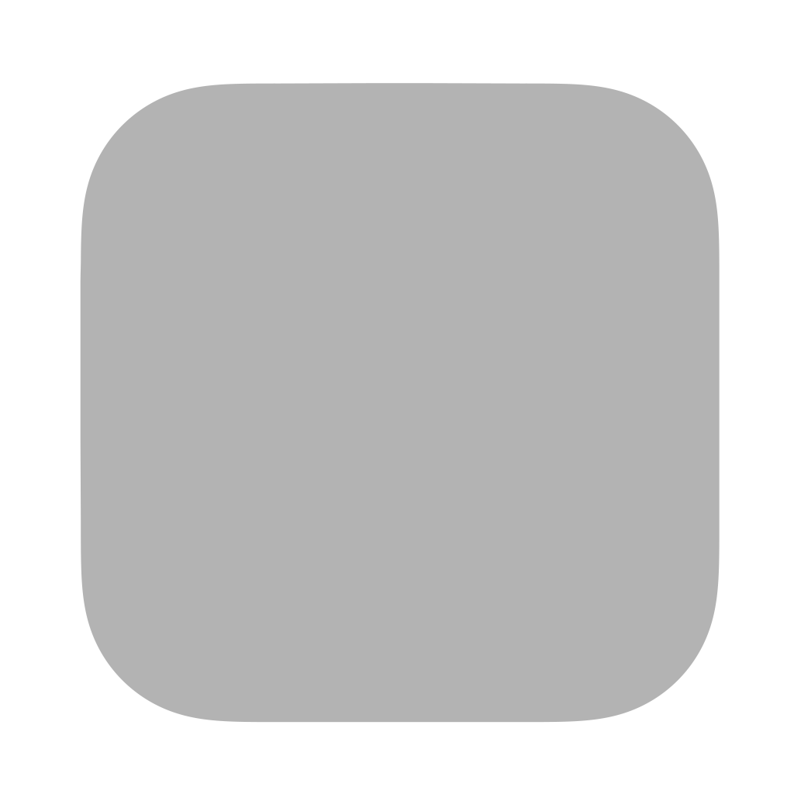

# Icons

Conveyor has these features to help you with icons:

* Conversion to the native icon formats.
* High quality rescaling of images to the correct set of sizes.
* Rendering of bitmap icons from SVG files, including making icons automatically fit the Apple/Linux and Windows conventions when rendering.
* Generation of default icons given just a one/two character label, or automatically from the display name.

## Synopsis

```
app.icons = "myapp-icon-*.png"
app.icons = "myapp-icon.svg"

# Render a simple icon with a label, gradient 
# and macOS compliant rounded corners.
app.icons = {
  label = "AP"
  gradient = "blue;green"
}
```

## Keys

**`app.icons`, `app.{windows,mac,linux,site}.icons`** An icon definition. You can use either:

1. An input definition to collect some image files.
2. An object, to define a generated icon.

## Input files

An [input definition](inputs.md) can be provided that should import either square images or an SVG file.

You can provide any number of square image files, as Conveyor will rescale the images to provide appropriate image
sizes for all platforms. You can directly provide the appropriate sizes (see below) to avoid artifacts from resampling.
Besides `.svg` supported image file types are: `.bmp`, `.gif`, `.png`, `.tif` and `.tiff`. Only images with an alpha channel (transparency) 
are allowed.

The icons are processed and converted into square images of sizes 16, 32, 64, 128, 256, 512 and 1024, as well as 44 and 150 for
Windows. You can provide images with those sizes directly if you prefer to handle rescaling yourself. Otherwise, it's a good idea to
provide at least a few different resolutions so scaling of the icon between sizes is smoother.

### Icon sizing for macOS

It's your responsibility to ensure icons look good on each platform. What works well on Windows might not work well on macOS or Linux.
Be aware that icons for macOS do not fill the entire image edge-to-edge. They have a transparent border into which foreground objects are
allowed to protrude.

Consider reading [Apple's design guidelines](https://developer.apple.com/design/human-interface-guidelines/app-icons#macOS) for how 
to draw a good icon for macOS. Here's [an SVG template](mac-icon.svg) you can use to get the right metrics and drop shadow:

{ width="50%" height="50%" }

You can then override your default icons with macOS specific variants:

```
app {
    mac {
        icons = "icons/mac/*.png"
    }
}
```

## Generating icons

If you supply a [HOCON](hocon.md) object consisting of the following fields, Conveyor will draw an icon for you. This is useful for quick
apps that don't justify custom artwork.

* **`label`** An optional short string containing one or two characters which will be rendered as the icon. If not provided, a
  label is derived from the `app.display-name` key.
* **`gradient`** An optional string containing one or
  two [CSS style colors](https://developer.mozilla.org/en-US/docs/Web/CSS/color_value)
  separated by a semicolon (;). If not provided, a random gradient color is provided using the `label` as a seed.

Generated icons have rounded corners on all systems except Windows, where they instead fill the entire icon to comply with the platform style.

By default, icons will be generated with a label based on the contents of `app.display-name` with a random gradient background.
