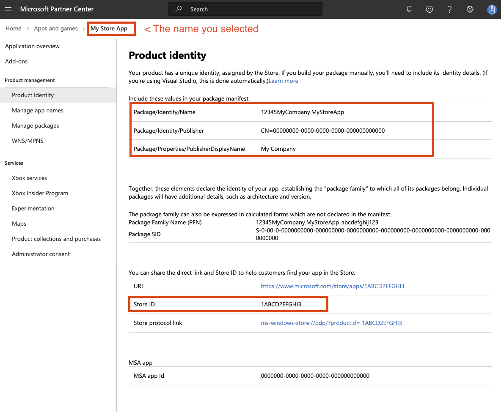

# Windows

## Synopsis

```properties
app.windows {
  # Windows specific inputs.
  inputs = [ ... ]

  # Controls whether a terminal window appears on startup.
  console = false

  # What online update style to use.
  updates = background
  
  # Options related to the Windows installer.
  installer {
    # Which theme should be used for the installer UI.
    theme = dark
  }

  # Whether to sign the EXE/DLL files or not (true/false).
  sign = ${app.sign}
}
```

## Keys

### `app.windows.updates`

See [update modes](update-modes.md).

### `app.windows.timestamping-server`

URL of a cryptographic timestamping server (often called a timestamping authority or TSA). These are usually run by certificate authorities. Defaults to using Certum because their timestamping server is fast and well run, but you can use any TSA that is trusted by Windows. The URL must start with `http://` because the TSA protocol doesn't use SSL. 

### `app.windows.sign`

Controls whether to sign the Windows EXE/DLL/package files. Defaults to the value of `${app.sign}` (which is true). The value could be one
of `true` (meaning regular signing done by Conveyor is enabled), `false` (disabling signing altogether, and disables production of an MSIX
file), or an object to allow specifying custom scripts for signing your MSIX package, like the following:

```hocon
app {
  mac {
    sign = {
      scripts = {
        // Custom script for signing the MSIX package.
        msix = "my-msix-signing-script.bat $MSIX"
        
        // Custom script for signing the individual binary files.
        binary = "my-binary-signing-script.bat $FILE"
      }
    }
  }
}
```

#### `app.windows.sign.scripts.msix`

Defines a custom program to be used for signing your Windows MSIX package. It will be a command line run from the working directory where Conveyor is executed.
The following replacements are made when running the command:

* `$MSIX`: will get replaced with the full path to the MSIX file that must be signed by the provided script. You don't need quoting as Conveyor will do that for you.

The program should sign the file located at the given `$MSIX` path **in-place**. It can be any arbitrary command, and doesn't specifically have to be a script.

!!! important "Caching" 
    For speed reasons Conveyor will cache the signed MSIX produced by the given custom script. The cache key contains both the configured
    command line and a fingerprint (hash) of the script itself. If you change the script or the command line, the signing operation will be rerun.
    However if you change a *dependency* of your script then that won't be detected, as only the command itself is fingerprinted. In that
    case you will need to modify the command too e.g. by altering a version number in a header comment.

#### `app.windows.sign.scripts.binary`

Defines a custom script to be used for signing individual Windows binary files (DLLs, EXE, etc.) present in the app. It will be a command
line run from the working directory where Conveyor is executed. The following replacements are made when running the command:

* `$FILE`: will get replaced with the full path to a Windows binary file that must be signed by the provided script.

The script should sign the file located at the `$FILE` path **in-place**. It will be called once for each Windows binary located in your app, both inside and outside JARs.

This script is *only* called if you also specify an `msix` script, to avoid mixing up of credentials when signing different parts of the app. If you're already handling individual binary files from your `msix` script, this script isn't needed.


### `app.windows.signing-key`, `app.windows.certificate`, `app.windows.verify-certificate-chain`

See [signing keys](index.md#signing).

### `app.windows.override-icon` 

Boolean, default is true. If true and an icon is already present in the EXE resources, it will be replaced with the icon produced by Conveyor. Useful when working with frameworks that use their own logo as the default EXE icon.

### `app.windows.exe-installer-basename`

String, the base name of the EXE installer file generated by Conveyor, without the ".exe" extension. Defaults to the value of key `app.fsname`.

### `app.windows.start-on-login`

Boolean, if `true` then your app will be started automatically when users log in to Windows. 

No user interaction or confirmation is required so be careful not to abuse this. The user can disable/enable startup via the Task Manager, and there's no programmatic way to override the user if they disable your startup item there. 

You can programmatically enable/disable these items using [the WinRT StartTask API](https://learn.microsoft.com/en-us/uwp/api/windows.applicationmodel.startuptask?view=winrt-22621) (these APIs are available by default and can be accessed from ordinary C++). The startup task ID is the identity name of your app concatenated with `.StartupTask`, where the identity name can be explicitly controlled but defaults to the `app.fsname` key converted from `kebab-case` to `PascalCase`.

## Console key

### `app.windows.console`

Windows requires a program to declare up front if it's a command line or GUI app using a flag in the EXE file headers. If an app is declared GUI then anything it prints to stdout/stderr won't appear anywhere, not even when run from the command line. If it's declared to be a command line app and run from outside a terminal, then a console window will appear alongside the app's main window. 

Normally this header is set by the compiler. Conveyor can set it for you to the value of the `app.windows.console` key. If you don't specify this setting then Conveyor will attempt to guess, based on the presence of DLLs that are known to be used by JVM GUI toolkits. If DLLs for AWT/Swing, JavaFX, SWT, Skiko/Jetpack Compose or LWJGL are present then it's believed to be a GUI app. Otherwise it's a console app. If this heuristic isn't good enough then please let us know so we can update it, and then set the key explicitly.

When a package contains console mode EXEs your MSIX package will register itself as a command line app. The moment installation completes it becomes accessible in all running terminal sessions.

What if your app is both a CLI *and* a GUI app simultaneously? You can certainly still accept command line switches, even for GUI mode apps. It's only console output and input that's affected by this flag. If you need both then you will need to prepare separate EXEs for your app, one for each mode, and provide them as Windows-specific inputs. The GUI mode exe should have the same name as the generated launcher would: `${app.display-name}.exe`. The CLI mode exe can be named whatever you want.

## Installer options

### `app.windows.installer.theme`

Which theme to be used for the Windows installer. Currently Conveyor supports themes `light` and `dark`. If this is left unset, the Installer will automatically select `light` or `dark` according to the Windows theme currently in use.
By default, this will follow the value of `app.theme`.

## Manifests

Manifests are XML files that control how your app is managed by the operating system. There are two different manifests, but they use some of the same data.

### `app.windows.manifests.version-quad`

A four-part numeric version derived from `app.version` if not specified. Example: "1.2.3.4".

### `app.windows.manifests.validate`

The MSIX manifest XML is validated against Microsoft's schemas because non-validating XML won't install. In the unlikely event this goes wrong and you need to disable it, set this to false. Normally you will never encounter validation errors, but if you alter the manifest properties or provide your own XML you may encounter such issues.

### `app.windows.manifests.exe.content`

An [EXE application manifest](https://docs.microsoft.com/en-us/windows/win32/sbscs/application-manifests) is an XML file embedded into the executable of a program. It controls:

* Backwards compatibility modes.
* Whether the app needs administrator privileges or not ([see below](#requesting-administrator-access)).
* HiDPI scaling options.
* Scroll event resolution.

And a variety of other operating system behaviours. The default manifest provided by Conveyor should be sufficient for most apps, and will replace whatever is found in the binary.

You can adjust some of the values using config keys; if they don't meet your needs then just replace the entire content.

### `app.windows.manifests.exe.requested-execution-level`

[See below](#requesting-administrator-access). One of:

* `asInvoker` - whatever privilege level the user has.
* `highestAvailable` - whatever privilege level the user can potentially escalate to.
* `requireAdministrator` - requires administrator access and cannot run without it (see below).

### `app.windows.manifests.msix`

An AppX manifest file in the final generated MSIX package. It controls many different integration points with the OS, including:

* Package metadata, which controls how your app appears in the confirmation screen the user sees when they open the package.
* Compatibility information: min Windows version required and max version tested, which can be used to tell the user they can't install the app, and which may change how Windows applies backwards compatibility logic.
* The name of the EXE file that should be run from the start menu.
* Permission/capability requests.

[A full schema is available here](https://docs.microsoft.com/en-us/uwp/schemas/appxpackage/uapmanifestschema/schema-root). Some parts of the default manifest can be controlled via configuration, but you can also completely replace the manifest with your own.

### `app.windows.manifests.msix.min-version`

Which version of Windows is required to run this application. Defaults to `10.0.17763.0` i.e. Windows 10 build 17763, which was released in November 2018 (codename "Redstone 5").

### `app.windows.manifests.msix.max-version-tested`

Which version of Windows the app has been tested on. This is used by Windows to detect packages for apps that have stopped being maintained and thus may need workarounds for bugs. The version this is set to will be updated with time to reflect whatever the latest versions of Windows 10 are, reflecting the assumption that if you're rebuilding your packages then the app is in active use and being tested.

### `app.windows.manifests.msix.capabilities`  

The list of requested permissions, [as documented by Microsoft](https://docs.microsoft.com/en-us/windows/uwp/packaging/app-capability-declarations). A string can be prefixed by a namespace code like `uap:` or `uap2:` to put the `<Capability/>` tag into the right namespace.

Defaults to `rescap:runFullTrust` which is intended for normal Win32 apps, and means the app is hardly sandboxed at all. A small amount of filesystem virtualization is applied to ensure the app can be uninstalled cleanly and apps aren't allowed to write to their own install folder, but that's about it. You shouldn't list any other capabilities unless you are explicitly using modern UWP Windows APIs that support sandboxing.

### `app.windows.manifests.msix.identity-name` 

An ASCII name for the program used for internal identification, that doesn't have to be globally unique. If written in lower case `kebab-case` it will be converted to `PascalCase` to match the normal Windows style. Defaults to `${app.fsname}`, which will get converted to `PascalCase`.

### `app.windows.manifests.msix.application-id`

An ASCII name for the identification of the applications within the package, that doesn't have to be globally unique. If written in lower case `kebab-case` it will be converted to `PascalCase` to match the normal Windows style. Defaults to `${app.fsname}`, which will get converted to `PascalCase`.

### `app.windows.manifests.msix.{display-name,description,vendor}`

Package metadata that will appear in the Windows user interface. Taken from the top level app metadata by default but can be overridden.

### `app.windows.manifests.msix.background-color`

Background color of the app tile in Windows. Can be either an RGB hex color preceded by a `#` character (e.g., `#ABCD12`), or a [color name supported by Microsoft](https://learn.microsoft.com/en-us/uwp/schemas/appxpackage/uapmanifestschema/element-uap-visualelements#remarks). From [compatibility level](../compatibility-levels.md) 12, it defaults to `transparent`. Before that, it defaulted to `#ffffff`. 

### `app.windows.manifests.msix.extensions-xml`

Raw XML that will be added into the Application-scoped `<Extensions/>` tag in the manifest. Useful for adding operating system integrations that Conveyor doesn't yet support out of the box.

### `app.windows.manifests.msix.package-extensions-xml`

Raw XML that will be added into the top level Package-scoped `<Extensions/>` tag in the manifest. Useful for adding operating system integrations that Conveyor doesn't yet support out of the box.

### `app.windows.manifests.msix.additional-properties-xml`

Raw XML that will be added into the `<Properties></Properties>` tag in the manifest. Useful for adding operating system integrations that Conveyor doesn't yet support out of the box.

### `app.windows.manifests.msix.virtualization`

Virtualization options. See [Virtualization](#virtualization) for details.

### `app.windows.manifests.msix.namespaces`

A map of namespace ID to XML namespace URL. You can use this to add declarations of additional namespaces if the default list doesn't have the one you need.  The list of XML namespaces in the default config is:

* `com:` http://schemas.microsoft.com/appx/manifest/com/windows10
* `com2:` http://schemas.microsoft.com/appx/manifest/com/windows10/2
* `desktop:` http://schemas.microsoft.com/appx/manifest/desktop/windows10
* `desktop2:` http://schemas.microsoft.com/appx/manifest/desktop/windows10/2
* `desktop3:` http://schemas.microsoft.com/appx/manifest/desktop/windows10/3
* `desktop4:` http://schemas.microsoft.com/appx/manifest/desktop/windows10/4
* `f2:` http://schemas.microsoft.com/appx/manifest/foundation/windows10/2
* `iot:` http://schemas.microsoft.com/appx/manifest/iot/windows10
* `rescap:` http://schemas.microsoft.com/appx/manifest/foundation/windows10/restrictedcapabilities
* `rescap2:` http://schemas.microsoft.com/appx/manifest/foundation/windows10/restrictedcapabilities/2
* `rescap3:` http://schemas.microsoft.com/appx/manifest/foundation/windows10/restrictedcapabilities/3
* `rescap4:` http://schemas.microsoft.com/appx/manifest/foundation/windows10/restrictedcapabilities/4
* `rescap6:` http://schemas.microsoft.com/appx/manifest/foundation/windows10/restrictedcapabilities/6
* `uap:` http://schemas.microsoft.com/appx/manifest/uap/windows10
* `uap2:` http://schemas.microsoft.com/appx/manifest/uap/windows10/2
* `uap3:` http://schemas.microsoft.com/appx/manifest/uap/windows10/3
* `uap4:` http://schemas.microsoft.com/appx/manifest/uap/windows10/4
* `uap5:` http://schemas.microsoft.com/appx/manifest/uap/windows10/5
* `uap6:` http://schemas.microsoft.com/appx/manifest/uap/windows10/6
* `uap7:` http://schemas.microsoft.com/appx/manifest/uap/windows10/7

### `app.windows.manifests.msix.ignorable-namespaces` 

A list of XML namespace IDs to add to the `IgnorableNamespaces` attribute on the root element. This is part of how Microsoft enables graceful degradation on older versions of Windows. The default list is `[ rescap6, uap7, uap8 ]`.

### `app.windows.manifests.msix.content` 

If set, supplies a string containing a complete manifest that replaces the standard one. The other keys will be ignored in this case, as they are only used to customize the built-in template.

## Virtualization

Windows provides a [virtualization mechanism](https://learn.microsoft.com/en-us/windows/msix/desktop/flexible-virtualization#default-msix-behavior) that aims to provide a clean uninstall, by ensuring that the app-private files and registry keys belonging to a given app can be identified and removed along with it. This is implemented by redirecting writes to the user's `AppData` directory to an app-specific location created by Windows. The app is unaware this is happening because it sees an overlay filesystem view.

There are some circumstances where apps might need to share data with each other, and Microsoft provides a [mechanism to allow excluding certain files from virtualization](https://learn.microsoft.com/en-us/windows/msix/desktop/flexible-virtualization). Conveyor makes it simple to use this mechanism by providing the following key:

### `app.windows.manifests.msix.virtualization.excluded-directories`

List of strings containing directories that should be excluded from virtualization. The first part of each directory must be the name of a [Known Folder](https://learn.microsoft.com/en-us/uwp/schemas/appxpackage/uapmanifestschema/element-virtualization-excludeddirectory#remarks) such as `RoamingAppData` or `LocalAppData`. For example:

```hocon
app.windows.manifests.msix.virtualization {
  # Exclude the entire RoamingAppData folder from virtualization.
  excluded-directories += RoamingAppData

  # Exclude a single folder within LocalAppData folder from virtualization.
  excluded-directories += LocalAppData/OtherAppsFolder
}
```

!!! important "Microsoft Store"
    Setting this key will not only generate the correct fragment of the MSIX manifest, it will also implicitly enable the `unvirtualizedResources` restricted capability, which is necessary in this case. If you submit such an app to the Microsoft Store they will request a justification for why you need it.

!!! note "UNIX domain sockets"
    Some versions of Windows have a kernel bug that breaks UNIX domain sockets when they are stored in a virtualized directory. A reasonable workaround is to add to the `excluded-directories` key `LocalAppData/Temp`, thus excluding the temp dir from virtualization. Between compatibility levels 8 and 11 Conveyor did this automatically to ensure JVM apps could work correctly. Starting from Conveyor 12 a different workaround is used and this exclusion is no longer needed.  

!!! note "Old Windows 10 versions"
    Windows 10 builds before 21H1 will have filesystem virtualization disabled entirely when there are any excluded directories, as the ability to control virtualization on a per-directory level was only introduced in that version.

## Escape hatch mechanism

Conveyor provides a mechanism to download and run arbitrary code at startup. This enables you to handle various scenarios that the base
Windows package manager cannot. [Learn more about the escape hatch](escape-hatch.md). 


## Visual C++ redistributables

If your app needs the MSVC++ runtime DLLs you should ship them with your app, as Windows doesn't come with these DLLs out of the box. [Conveyor has built in support for this](../stdlib/index.md#microsoft-visual-c-redistributables).

## Requesting administrator access

To show a request Windows administrator access for your program you will need to set two keys:

```
app {
    // Request administrator access.
    windows.manifests {
        exe.requested-execution-level = requireAdministrator
        msix.capabilities += "rescap:allowElevation"
    }
}
```

When they start your app the user will see a UAC prompt that looks like this one:


## Application User Model ID (AUMID)

If you need to know your app's [AUMID](https://learn.microsoft.com/en-us/windows/win32/shell/appids), just run:

```shell
conveyor make app-user-model-id
```

It will output the AUMID to the standard output.

## Release to the Microsoft Store

Conveyor supports releasing to the [Microsoft Store](https://apps.microsoft.com/). This can be a great choice as the store offers various
useful features and an account is much cheaper than buying a code signing certificate.

The first thing you need is to set up an account at the Microsoft Partner Center:

1. [Register as a Windows app developer in Microsoft Partner Center](https://learn.microsoft.com/en-us/windows/apps/publish/partner-center/partner-center-developer-account).
2. Have a tenant associated with your Partner Center account. You can achieve that by either [associating an existing Azure AD in Partner Center](https://learn.microsoft.com/en-us/windows/apps/publish/partner-center/associate-existing-azure-ad-tenant-with-partner-center-account) or by [creating a new Azure AD in Partner Center](https://learn.microsoft.com/en-us/windows/apps/publish/partner-center/create-new-azure-ad-tenant).

With the account properly set up, you'll need to make the first release. Due to [limitations in the Store API](https://learn.microsoft.com/en-us/windows/uwp/monetize/create-and-manage-submissions-using-windows-store-services#step-1-complete-prerequisites-for-using-the-microsoft-store-submission-api), the first submission of your app has to be done manually.

- [ ] Make sure you're logged in to Partner Center as the Azure AD tenant user name (e.g. `user@yourdomain.onmicrosoft.com`). If you're logged in as a personal user name you may receive permission errors when reserving your app name.
- [ ] In the Partner Center, [reserve your app's name](https://learn.microsoft.com/en-us/windows/apps/publish/publish-your-app/reserve-your-apps-name?pivots=store-installer-msix). Make sure to select **MSIX or PWA app** when specifying the app type.
- [ ] In your `conveyor.conf`, make sure your `app.display-name` matches the name you reserved for your app.
- [ ] In the new app overview, go to the **Product Identity** page. You'll need to fill out the `app.windows.store` keys in your `conveyor.conf` with the values from this page as follows:

    * `app.windows.store.identity-name`: copy the value of the **Package/Identity/Name** field
    * `app.windows.store.publisher`: copy the value of the **Package/Identity/Publisher** field.
    * `app.windows.store.publisher-display-name`: copy the value of the **Package/Properties/PublisherDisplayName** field.
    * `app.windows.store.store-id`: copy the value of the **Store ID** field.

- [ ] If you've already configured a regular Windows signing certificate set `app.windows.certificate = "self signed by "${app.windows.store.publisher}"` in your config to turn it off and use self-signing (you don't need to, and should not, CA sign a Microsoft Store upload). 

For example, if the **Product Identity** page looks like this:



Then these fields in your config should look like this:

```
app {
    display-name = "My Store App"

    windows {
        store {
            identity-name = "12345MyCompany.MyStoreApp"
            publisher = "CN=00000000-0000-0000-0000-000000000000"
            publisher-display-name = "My Company"
            store-id = "1ABCD2EFGHI3"
        }
        
        // Optional, see above.
        certificate = "self signed by "${app.windows.store.publisher}
    }
}
```
 
- [ ] As a quick double check, run `conveyor make app-user-model-id` and ensure the output string matches the "Product Family Name" on the product identity page.
- [ ] Build the initial version of your app by running `conveyor make windows-msix`. It will generate an MSIX file in the `output` dir that you'll need to submit to the store.

### Creating the initial submission

[Create an app submission for your app](https://learn.microsoft.com/en-us/windows/apps/publish/publish-your-app/create-app-submission?pivots=store-installer-msix). 

- [ ] Go to **App Overview** and click **Start Submission**. In the **Packages** section, upload the MSIX file generated in the previous step. Fill out the other details as required (screenshot, privacy policy etc).
- [ ] When asked why you need `runFullTrust`, say: "This is a native Win32 app and thus cannot run in the UWP sandbox".

Once your initial submission gets approved, Conveyor can manage the updates for you. You'll need to authorize Conveyor to send submissions on your behalf:

1. [Create a new Azure AD application](https://learn.microsoft.com/en-us/partner-center/marketplace/manage-aad-apps#add-new-azure-ad-applications) to be used by Conveyor. You can enter any [valid address](https://learn.microsoft.com/en-us/azure/active-directory/develop/security-best-practices-for-app-registration#application-id-uri) for **Reply URL** and **App ID URI**, as long as those values are not used by any other Azure AD application in your directory. A simple suggestion is to use `https://<your microsoft domain>.onmicrosoft.com/conveyor` for both. Select **Manager (Windows)** as the role for this new application.
2. Select the newly created application and click **Add new key**. Take note of the **Client ID** and **Key** values, copy them into your Conveyor config 
 as the values for `app.windows.store.client-id` and `app.windows.store.client-secret` respectively.
3. Click **Cancel** to go back. Take note of the **Tenant ID**, copy it into your `conveyor.conf` as the value for `app.windows.store.tenant-id`.
 
Now you can run `conveyor make ms-store-release`, and Conveyor will submit the new versions of your app directly to the Microsoft Store.

### Microsoft Store caveats

Here are some Microsoft-imposed limitations to be aware of when publishing to the store:

- You can't switch between out-of-store and in-store distribution.
- You can't use [aggressive updates mode](update-modes.md#aggressive-updates).
- The `app.revision` number must be zero as the store uses the revision number for its own purposes.
- The first version of your app must be uploaded manually.
- Microsoft may need to verify your identity as part of setting up an account.
- There is a setup process required to both create your app entry, and enable Conveyor to push to it.
- There are [various policies](https://learn.microsoft.com/en-us/windows/apps/publish/store-policies) you must comply with, for example, it must be possible for an app tester to log in.
