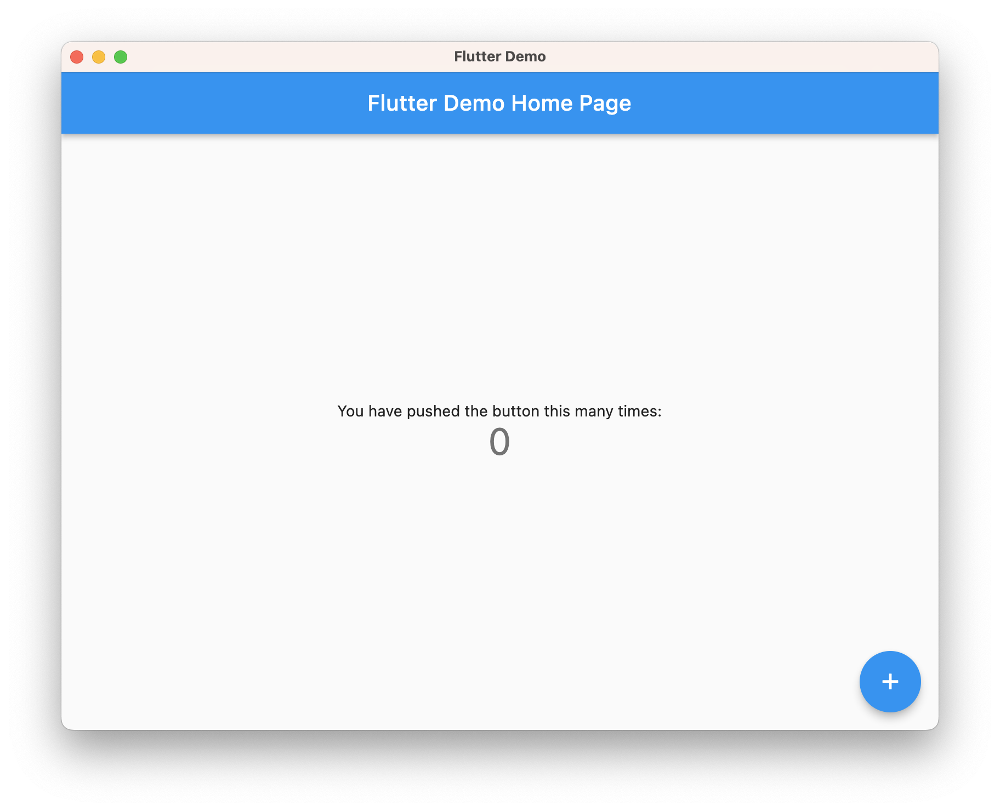

# Getting started

[ :material-arrow-down-circle: Download](https://downloads.hydraulic.dev/conveyor/download.html){ .md-button .md-button--primary } [ :material-arrow-up-box: Start tutorial](tutorial/new.md){ .md-button .md-button--primary } [ :simple-discord: Chat](https://discord.gg/E87dFeuMFc){ .md-button .md-button--primary } [ :material-forum: Forum](https://github.com/hydraulic-software/conveyor/discussions){ .md-button .md-button--primary }

Conveyor makes distributing desktop apps as easy as shipping a web app. It's a tool not a service, it generates and signs [self-upgrading packages for Windows, macOS and Linux using each platform's native package formats](outputs.md) without requiring you to have those operating systems, and it looks like this:

<video width="100%" poster="https://conveyor.hydraulic.dev/assets/promo.jpg" controls><source src="https://conveyor.hydraulic.dev/assets/promo.mp4" type="video/mp4"></video>

It has integrated support for Electron, JVM and Flutter apps. It's free for open source apps and has [simple per-project pricing](https://www.hydraulic.dev/pricing.html) for commercial apps.

## Features

* **Self-updating packages for every OS, built on any OS.**
* **[Background updates or check-on-launch.](configs/index.md#update-modes)**
* **Extra support for popular app frameworks**: 
    * **[Electron](configs/electron.md)**
    * **[JVM](configs/jvm.md)**
    * **[Flutter](configs/flutter.md)**
* **Brainless code signing**, also with self-signing support.
* **Icon generation, rendering and format conversion** 
* **Generates download sites**
* **Automatic releasing** to web servers, S3 or [GitHub releases](configs/download-pages#publishing-through-github).
* **Generate starter projects** for native C++, Electron, JavaFX (JVM) and Jetpack Compose Desktop (JVM).
* **Pierce the abstraction!** Over 120 different settings let you take control of every OS specific detail.
* **No lockin** thanks to using standard package formats and open source frameworks.

## Sample apps

### Electron: GitHub Desktop

This shows how a production-grade Electron app can be packaged using Conveyor, GitHub Actions and GitHub Releases.

</img>

[Download a Conveyor-ized GitHub Desktop](https://hydraulic-software.github.io/github-desktop/download.html){ .md-button .md-button--primary } [View source](https://github.com/hydraulic-software/github-desktop/){ .md-button }

### Flutter

</img>

[Download](https://hydraulic-software.github.io/flutter-demo/download.html){ .md-button .md-button--primary } [View source](https://github.com/hydraulic-software/flutter-demo){ .md-button }

### JVM: Jetpack Compose

<video width="100%" playsinline autoplay muted loop style="margin-left: -50px"><source src="https://www.hydraulic.dev/assets/images/video/Eton.mp4" type="video/mp4"></video>

</img>

[Download (fully signed)](https://hydraulic-software.github.io/eton-desktop/download.html){ .md-button .md-button--primary } [Download (self signed)](https://downloads.hydraulic.dev/eton-sample/selfsigned/download.html){ .md-button } 

[View source](https://github.com/hydraulic-software/eton-desktop){ .md-button }

 

This is an open source example app written in Kotlin. It uses Material Design and the [Jetpack Compose](https://www.jetbrains.com/lp/compose-desktop/) reactive UI toolkit, which is the new standard Android GUI toolkit and also has a desktop port supported by JetBrains.

### JVM: AtlantaFX Sampler

<video width="100%" playsinline autoplay muted loop style="margin-left: -70px"><source type="video/mp4" src="https://www.hydraulic.dev/assets/images/video/AtlantaFX-1.1.mp4"/></video>

[Download AtlantaFX sampler](https://downloads.hydraulic.dev/atlantafx/sampler/download.html){ .md-button .md-button--primary } [View source](https://github.com/hydraulic-software/atlantafx){ .md-button }

[AtlantaFX](https://github.com/mkpaz/atlantafx) is an open source theme for JavaFX that implements a modern design language using the GitHub Primer color system. The sampler app provides a gallery of the available controls and stylings. It's written in Java with Maven. Read [the blog post](https://hydraulic.dev/blog/3-atlantafx-sampler.html) to learn how this app was packaged.
