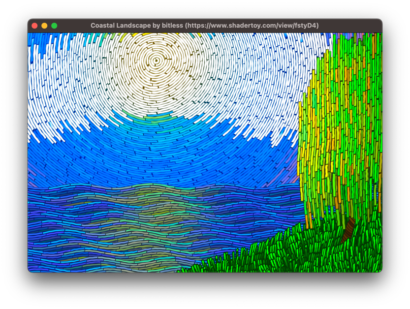

# Native apps

{!tutorial/hare/start.md!}

We'll generate, compile and package a C++ app that uses OpenGL to render a pixel shader.

<div style="margin-left: -55px" markdown>

</div>

## Create a sample project

=== ":simple-windows: Windows"

    * [ ] Install [CMake](https://cmake.org/) and the compiler toolchain (e.g. Visual Studio).
    * [ ] Run these commands: 
      ```
      conveyor generate cmake com.example.my-project
      cd my-project
      mkdir build\windows
      cd build\windows
      cmake ..\..
      cmake --build . --config Release --target install
      ```
  
=== ":simple-apple: macOS"

    * [ ] Install [CMake](https://cmake.org/) and Xcode.
    * [ ] Run these commands:
      ```
      conveyor generate cmake com.example.my-project
      cd my-project
      mkdir -p build/mac
      cd build/mac
      cmake ../..
      make install
      ```

=== ":simple-linux: Linux"

    * [ ] Install [CMake](https://cmake.org/) and your distro's development tools. You may also need to install extra development libraries. On Ubuntu/Debian, try `sudo apt install build-essential libx11-dev xserver-xorg-dev xorg-dev` first.
    * [ ] Run these commands:
      ```
      conveyor generate cmake com.example.my-project
      cd my-project
      mkdir -p build/linux
      cd build/linux
      cmake ../..
      make install
      ```

{!tutorial/hare/github-tip.md!}

## Edit the config

In this tutorial we'll only build packages for the same OS you're running on, to avoid the need for cross-compilation. 

=== ":simple-windows: Windows"

    * [x] Open `conveyor.conf` and replace the line that says `machines = [windows.amd64, linux.amd64.glibc, mac.amd64, mac.aarch64]` with
          `machines = windows.amd64`

=== ":simple-apple: macOS"

    * [x] Open `conveyor.conf` and replace the line that says `machines = [windows.amd64, linux.amd64.glibc, mac.amd64, mac.aarch64]` with
          `machines = mac.amd64` (if on Intel) or `machines = mac.aarch64` (if on Apple Silicon).

=== ":simple-linux: Linux"

    * [x] Open `conveyor.conf` and replace the line that says `machines = [windows.amd64, linux.amd64.glibc, mac.amd64, mac.aarch64]` with
          `machines = linux.amd64.glibc`

## Create the unpackaged app

{!tutorial/hare/create-unpackaged-app.md!}

## Serve the download site

{!tutorial/hare/serve-with-npx.md!}

{!tutorial/hare/serve-without-npx.md!}

It's self-signed, so you'll need to follow the instructions for how to install it. We'll fix that later.

## Release an update

In another terminal tab:

* [x] Change the `const char *title` string in `src/main.cpp` to something else.
* [x] Rebuild the binaries using CMake.
* [x] Edit `conveyor.conf` and change the version key to `2`.
* [x] Run `conveyor make site` to regenerate the download site.

{!tutorial/hare/apply-update-instructions.md!}

## Read the config

It looks like this:

```
app {
  display-name = "My Project"
  fsname = "my-project"
  version = 2
  site.base-url = "localhost:3000"
  rdns-name = "com.example.my-project"

  machines = [windows.amd64, linux.amd64.glibc, mac.amd64, mac.aarch64]

  icons {
    label = "GL"
  }

  mac.inputs = [
    build/mac/installation/bin -> Contents/MacOS
    build/mac/installation/lib -> Contents/Frameworks
  ]

  windows.amd64.inputs = build/windows/installation/bin
  linux.amd64.inputs = build/linux/installation
}
```

{!tutorial/hare/hocon-tip.md!}

The input definitions let us select where the executable and data files should be imported from.

[ :material-arrow-right-box: Learn more about inputs](../../configs/inputs.md){ .md-button .md-button--primary }

## Read CMakeLists.txt

* [x] Open the `CMakeLists.txt` file and read the comments.
* [x] Observe how linker flags are set for each platform to specify rpaths and `-headerpad` flags.

## Change the icon

Conveyor can draw icons for you.

{!tutorial/hare/generate-icons.md!}

You can of course also set the `icons` key to be a list of bitmap image files (e.g. PNGs), or an SVG file.

## Upload a real update site

{!tutorial/hare/upload-real-site.md!}

## Signing

{!tutorial/hare/signing.md!}

## Become a 🐢 tortoise

{!tutorial/hare/become-a-tortoise.md!}

<script>var tutorialSection = 300;</script>
